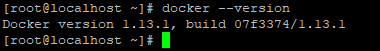

# Docker 명령어 연습

## 1. 도커 설치하기

Docker는 리눅스 배포판 종류를 자동으로 인식해서 패키지를 설치해주는 스크립트를 제공합니다.
```
$ sudo wget -qO- https://get.docker.com/ | sh
```
저는 MacOS용 설치 [도커 설치 for MacOS](https://hub.docker.com/editions/community/docker-ce-desktop-mac/)로 설치했습니다.

## 2. 도커 버전확인

```
docker --version
```
결과 값




아래는 docker로 진행된 내용입니다.

## [tomcat을 이용한 war 배포하기](https://github.com/SeongJunKang/doicker_practice/tomcat)