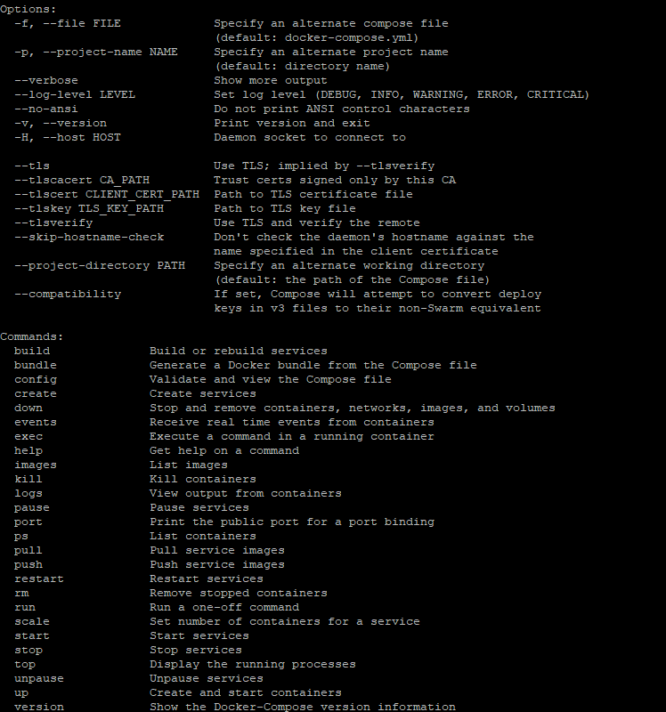

# Docker compose 
## 0. docker compose란 ?
여러개의 docker container를 하나하나 다루지않고, YAML 파일을 이용하여 여러개의 컨테이너 프로그램을 정의하고 실행하기 위한 도구입니다.<br>
여러 컨테이너의 정보를 기입하고, 명령어 하나로 docker container의 상태를 다룰 수 있습니다.

```
docker-compose up -d  // 백그라운드로 docker-compose.yml에 기입된 모든 컨테이너를 시작한다.
docker-compose down  //docker-compose.yml에 기입된 모든 컨테이너를 종료한다.
```

## 1. docker compose install

이 [링크](https://docs.docker.com/compose/install/)를 통해 docker-compose를 다운로드하고 설치할 수 있습니다.<br>
OS별 설치방법이 다르니 확인하여 설치를 합니다.

리눅스는 다음 명령어를 통해 docker-compose를 다운로드 받습니다.<br>
버전은 최신화하여 받도록 한다. 최신 버전은 이 [링크](https://github.com/docker/compose/releases)를 통해 확인할 수 있습니다.
```
sudo curl -L "https://github.com/docker/compose/releases/download/1.25.5/docker-compose-$(uname -s)-$(uname -m)" -o /usr/local/bin/docker-compose
```
## 2. 설치된 docker compose 사용할 수 있도록 권한 변경
```
sudo chmod +x /usr/local/bin/docker-compose
```

## 3. docker-compose 버전 확인
```
$ docker-compose --version
docker-compose version 1.25.5, build 1110ad01
```


## 4. docker-compose.yml 파일 생성
아래의 명령어를 사용하여 commands를 확인할 수 있습니다.<br>
```
docker-compose --help
```
<br>
```
vi docker-compose.yml
```

## 5. docker-compose 예시(스프링 부트)
docker compose로 스프링 부트 컨트롤하기<br>
```
version: '3.4'

services:
  spring-boot-docker:
    image: spring-boot-docker
    build:
      context: /usr/local/docker/spring-boot-docker
      dockerfile: /usr/local/docker/spring-boot-docker/Dockerfile
    container_name: spring-boot
    volumes:
      - type: bind
        source: /usr/local/docker/spring-boot-docker/files
        target: /usr/local/share/files
    ports:
      - "8080:8080"
    environment:
      SPRING_PROFILES_ACTIVE: production
```
version은 docker compose의 버전을 나타냅니다.<br>
services는 실행할컨테이너의 정보를 기입합니다.<br>
- 실행될 서비스명을 기입합니다.<br>
- image는 서비스를 실행할 때 사용할 image를 입력합니다.<br>
- build는 이미지가 없을 경우 image를 빌드하여 진행합니다.<br>
-- context는 dockerfile을 image로 빌드할 때, 필요한 폴더 혹은 파일의 위치를 지정할 때 사용합니다.<br>
-- dockerfile은 현재 빌드할 이미지의 dockerfile 경로를 지정합니다.<br>
- container_name은 현재 사용될 컨테이너의 이름을 지정합니다.<br>
- volumes 는 컨테이너와 호스트간의 공유할 폴더를 지정합니다.<br>
-- source는 호스트의 파일 혹은 폴더 경로를 지정합니다.<br>
-- target은 컨테이너의 폴더 경로를 지정합니다.<br>
- ports 는 [호스트 port]:[컨테이너 port]<br>
- environment는 환경변수로 컨테이너가 동작할 때 사용하는 환경변수를 입력합니다.<br>
network도 있는데 이는 컨테이너간의 네트워크연결을 위해서 사용합니다.(여기선 사용안함)<br>