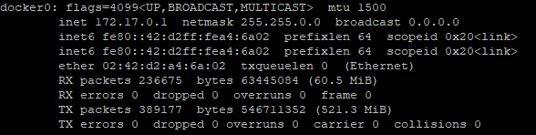

# docker-network

##  docker-network 에 대한 정리

### docker0 interface
docker를 설치하고 ifconfig docker0 명령어를 입력하면 다음의 내용을 확인할 수 있다. 

 

IP는 inet addr인 172.17.0.1 을 기본 bridge network로 가지게되고 netmask는 255.255.0.0으로 설정된다. 
network를 생성하면 172.18.0.1 처럼 숫자가 증가하게 된다. 
그리고 docker0는 docker 내부에서 동작하는 가상 이더넷 브릿지이다. 

container를 생성하면 172.17.???.???/16의 IP 대역을 할당받게된다. 
앞서 solr와 spring-boot를 연계하기 위한 내용을 작성했는데, network를 연계하면 도커 내부 ip를 연동할 수 있고, 서로 참조할 수 있게된다.