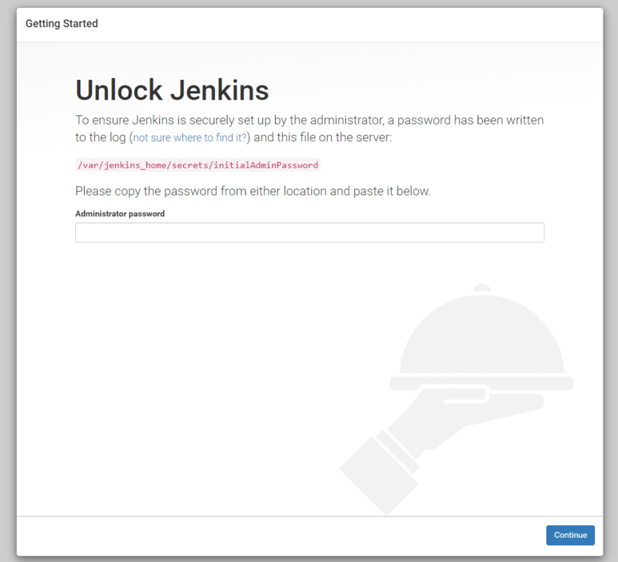
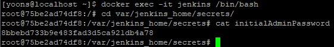

# docker로 Jenkins 설치하기

## 1. jenkins 이미지 다운로드

```
docker pull jenkins/jenkins:lts
```

스프링 부트를 jar 파일로 생성하여 Dockerfile을 만듭니다.

## 2. 다운로드된 jenkins 이미지 실행

```
docker run -d -p 8080:8080 -v /jenkins:/var/jenkins_home --name jenkins -u root \
-e JAVA_OPTS='-Duser.timezone=Asia/Seoul -Dfile.encoding=UTF-8 -Dsun.jnu.encoding=UTF-8' jenkins/jenkins:lts
```
여기서 옵션을 살펴보면<br>
-d : 백그라운드 실행<br>
-p : 포트 설정 (왼쪽이 linux / 오른쪽이 container)<br>
-name : container 이름<br>
-u : 사용자<br>
-e : 환경설정 (여기서는 타임존을 서울로 지정, 기본 jenkins의 타임은 다른 국가로 지정되어있음)<br>

## 3. jenkins 웹페이지 접속

웹 페이지로 접속하면 다음과 같은 화면이 나오는데<br>

<br>

docker로 jenkins에 접속하여 해당 경로로 가서 확인한다.<br>

```
docker exec -it jenkins /bin/bash
cat /var/jenkins_home/secrets/initialAdminPassword
```
<br>

## 4.플러그인 설치
플러그인을 설치하고, 계정을 설정하라는 페이지가 나온다.<br>
관리자 계정을 설정하고 다음으로 넘어가면 설정이 끝난다.<br>

## 5. docker-compose를 이용하여 관리

```
version: '3.3'

services:
        jenkins:
                container_name: jenkins
                restart: always
                image: jenkins/jenkins:lts
                user: root #root 혹은 권한을 충족해야 가능
                ports:
                        - '8080:8080'
                volumes:
                        - type: bind
                          source: /jenkins
                          target: /var/jenkins_home
                environment:
                      TZ: "Asia/Seoul"
```