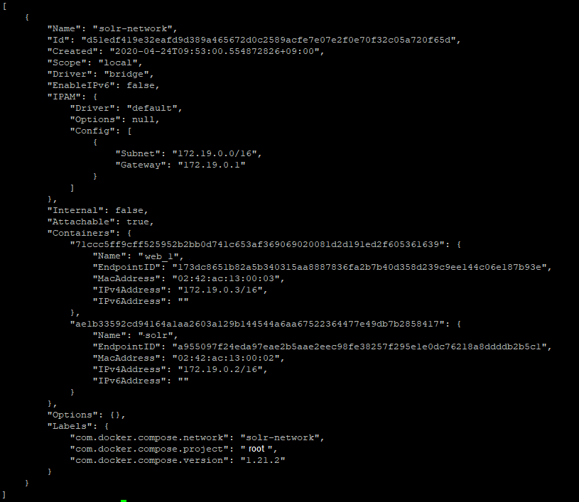

# Solr 설치하기

## 1. Solr docker pull

Solr docker image를 가져온다.
```
docker pull docker.io/solr:7-slim
```

## 2. Dockerfile을 생성하여 solr 이미지를 생성한다.

```
FROM docker.iod/solr:7-slim

# solr의 형태소분석기를 해당 경로로 복사한다.
ADD 형태소분석기플러그인 /opt/solr/server/solr-webapp/webapp/WEB-INF/lib/
```

## 3.Dockerfile 빌드하기
```
docker build -t solr-7 .
```

## 4.생성된 이미지 실행하기
아래의 명령어로 해당 Solr 컨테이너를 실행할 수 있습니다.
```
docker run -itd solr-7 -p 8983:8983 --name="solr-7-container"
```
## 5.  solr-core host로 복사하여 관리하기
```
docker cp solr-7-container:/opt/solr/server/solr /usr/local/solr/cores
```


## 6.  docker-compose로 관리하기

```
version: '3.4'

services:
  solr-7-container:
    image: solr-7
    build:
      context: /usr/local/docker/solr-7
      dockerfile: /usr/local/docker/solr-7/Dockerfile
    container_name: solr-7-container
    volumes:
      - type: bind
        source: /usr/local/solr/cores
        target: /opt/solr/server/solr
    ports:
      - "8983:8983"
    environment:      
      TZ: "Asia/Seoul"
      SOLR_JAVA_MEM: "-Xms1g -Xmx2g"
```


## 7. spring-boot 와 solr container network 연결하기
```
version: '3.4'
networks:
  solr-network:
    driver: bridge
    ipam:
      driver: default
      
services:
  solr-7-container:
    image: solr-7
    build:
      context: /usr/local/docker/solr-7
      dockerfile: /usr/local/docker/solr-7/Dockerfile
    container_name: solr
    volumes:
      - type: bind
        source: /usr/local/solr/cores
        target: /opt/solr/server/solr
    ports:
      - "8983:8983"
    environment:      
      TZ: "Asia/Seoul"
      SOLR_JAVA_MEM: "-Xms1g -Xmx2g" 
    network:
      - solr-network
      
  spring-boot-docker:
    image: spring-boot-docker
    build:
      context: /usr/local/docker/spring-boot-docker
      dockerfile: /usr/local/docker/spring-boot-docker/Dockerfile
    container_name: web
    volumes:
      - type: bind
        source: /usr/local/docker/spring-boot-docker/files
        target: /usr/local/share/files
    ports:
      - "8080:8080"
    environment:
      SPRING_PROFILES_ACTIVE: production
    network:
      - solr-network
```

ip 고정방식이 아닌 container 방식도 있는 것 같은데 아직 확인하지 못했다.
위 docker를 실행하면 network가 생기는데 아래 명령어로 확인할 수 있다.
```
docker network ls
```

자세한 내용을 보고싶으면 아래의 명령어를 사용하면 도커 내부의 ip를 확인할 수 있다.
web에서 해당 ip를 등록하여 solr 검색을 던질 수 있도록 수정해야한다. 환경변수를 이용해서 사용할 수 도 있다.
```
docker network inspect [name]
```

<br>
