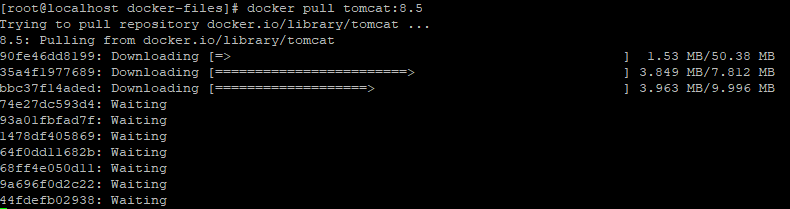

# Docker Tomcat War 배포하기

## 1. docker hub에서 war 배포를 위한 tomcat 가져오기

```
docker pull tomcat:lastest
docker pull tomcat:8.5
```

위 그림과 같이 나타나면서 이미지가 다운로드된다.

## 2. war 배포를 위한 Dockerfile 만들기


도커파일을 이용하여 이미지를 생성한다.

RUN은 다음의 명령어를 실행한다.
COPY는 현재 위치에서의 파일을 도커 컨테이너 경로로 복사한다.
ENV는 환경설정을 위한 명령어이다.
EXPOSE는 해당 포트를 사용하겠다는 명령어다.

도커 파일이 완료 되었으면 Dockerfile이 있는 위치에서 아래의 명령어로 이미지를 생성할 수있다
```
docker build -t [이미지명] .
```

## 3. 만들어진 이미지 실행하기.

아래의 명령어로 해당 톰캣 컨테이너를 실행할 수 있다.
```
docker run -itd [이미지명] -p 8080:8080 --name=[컨테이너명]
```